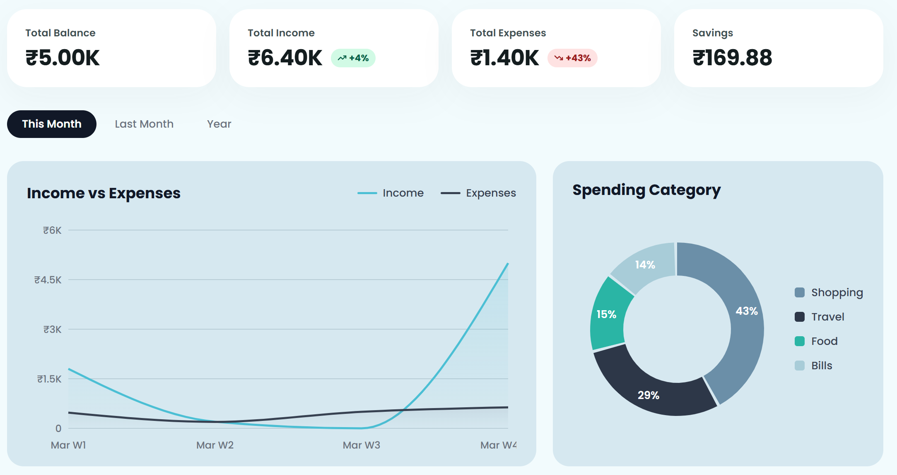
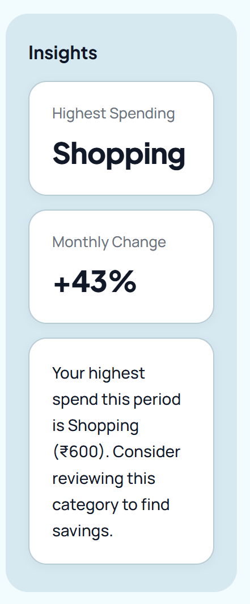
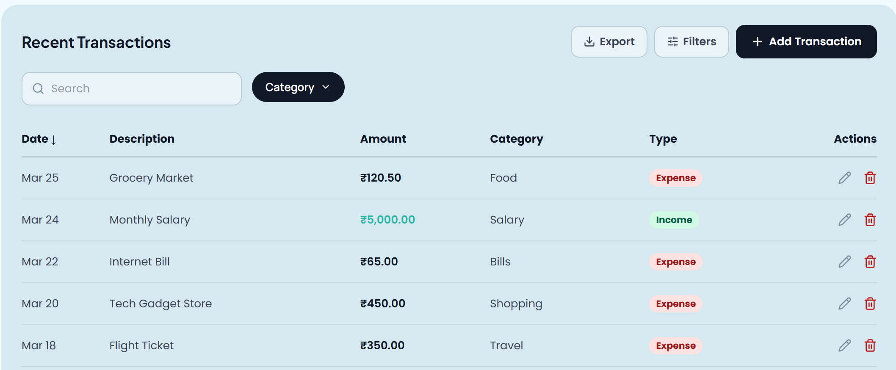
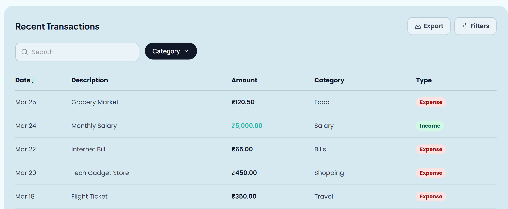

# Finance Dashboard

A polished, fully responsive personal finance dashboard built with **React 19**, **Zustand**, **Recharts**, and **Framer Motion**. Users can track income and expenses, analyse spending patterns, manage transactions, and switch between role-based views — with full localStorage persistence, mock API integration, dark mode, data export, and advanced filtering.

---

## Screenshots

> Run `npm run dev` and open `http://localhost:5173` in your browser.
>
> The dashboard supports **Light** and **Dark** modes — toggle via the **Dark** pill button in the top-right header.

---

## Tech Stack

| Layer | Choice | Rationale |
|---|---|---|
| Framework | **React 19 + Vite 8** | Fast HMR, ES module dev server, optimised production builds |
| Styling | **Tailwind CSS v4 + CSS custom properties** | Utility layout classes + a full design-token theme system for light/dark |
| State | **Zustand v5 + `persist` middleware** | Minimal boilerplate, hook-based, with automatic `localStorage` rehydration |
| Charts | **Recharts 3** | Composable, responsive SVG chart primitives |
| Animation | **Framer Motion 12** | Smooth staggered entrances, spring modals, animated filter panel |
| Icons | **Lucide React** | Consistent, tree-shakeable SVG icon set |
| Mock API | **In-process simulation** | `setTimeout`-based async layer mimicking real network latency |
| Design | **Stitch** | Used for UI design, layout planning, and visual prototyping before implementation |

---

## Quick Start

> **Prerequisites:** Node >= 18

```bash
# 1. Navigate into the project folder
cd finance-dashboard

# 2. Install dependencies
npm install

# 3. Start the development server
npm run dev
```

Open the URL printed in the terminal (default: `http://localhost:5173`).

```bash
# Build for production
npm run build

# Preview the production build locally
npm run preview
```

---

## Project Structure

```
src/
├── api/
│   └── mockApi.js               # Async mock API — simulates create/update/delete with network delay
├── assets/
│   └── logo.svg                 # App logo used in the sidebar
├── components/
│   ├── layout/
│   │   ├── Sidebar.jsx          # Floating dark sidebar (icon-only, hidden on mobile)
│   │   ├── DashboardHeader.jsx  # Greeting, role switcher, theme toggle, utility icons
│   │   └── BottomNav.jsx        # Mobile bottom navigation bar
│   ├── insights/
│   │   └── InsightsPanel.jsx    # Right-rail computed insights (desktop) / inline cards (mobile)
│   ├── StatCard.jsx             # Animated counter stat card with optional % badge
│   ├── IncomeVsExpensesChart.jsx # Smooth area chart — time-based income vs expense
│   ├── SpendingCategoryChart.jsx # Donut chart — categorical expense breakdown
│   ├── RecentTransactions.jsx   # Full table: search, filters, sort, export, CRUD
│   ├── TransactionModal.jsx     # Add / Edit transaction modal with spring animation
│   ├── PillTabs.jsx             # Time period selector (This Month / Last Month / Year)
│   └── DropdownSelect.jsx       # Reusable accessible styled dropdown
├── data/
│   └── mockTransactions.js      # Static mock data (Jan–Mar 2026) + chart data helpers
├── pages/
│   └── Dashboard.jsx            # Root page — assembles all sections with staggered entrance
├── store/
│   └── useFinanceStore.js       # Zustand store — single source of truth, persisted to localStorage
└── utils/
    └── exportUtils.js           # CSV + JSON file export utilities
```

---

## Feature Walkthrough

### 1. Dashboard Overview


The top of the page shows a greeting that changes based on the time of day — "Good morning", "Good afternoon", or "Good evening". On the right you can toggle between **Dark** and **Light** mode, switch between **Admin** and **Viewer** roles, and see utility icons (calendar, timer, notifications). The notification icons are static placeholders for now.

---



Below the header you get four stat cards — **Total Balance**, **Total Income**, **Total Expenses**, and **Savings** — each with an animated number counter and a live month-over-month % badge. Under the cards are three **pill tabs** (This Month / Last Month / Year) that re-filter everything on the page when clicked. The charts section has:
- A **line chart** comparing Income vs Expenses over time
- A **donut chart** showing where money was spent, broken down by category with a legend

---



On the right side (desktop) there is an **Insights panel** with three cards:
- **Highest Spending** — the category you spent the most on in the current period
- **Monthly Change %** — how your expenses changed compared to the previous period
- A **tip** suggesting which category to review to find savings

---



The **Transactions table** (Admin view) shows all transactions for the selected period. From here you can:
- **Search** by description or category
- **Filter** by category, type, amount range, and date range
- **Sort** by Date or Amount (click the column header)
- **Export** the current filtered results as CSV or JSON
- **Add**, **Edit**, or **Delete** transactions

---



In **Viewer mode**, the Add, Edit, and Delete controls are hidden — the table becomes read-only. This is the Role-Based Access Control (RBAC) behaviour: Admins can manage data, Viewers can only read it.

---


The **navigation bar** sits on the left side as a floating dark sidebar on desktop. On mobile (screens under 1024 px) it moves to the bottom of the screen as a standard bottom nav bar.

---

## State Management

All application state lives in a single **Zustand store** (`src/store/useFinanceStore.js`), persisted via the `persist` middleware to `localStorage` under the key `finance-dashboard-store`.

```
State shape:
├── allTransactions   — full authoritative transaction list (survives add/edit/delete)
├── transactions      — period-filtered derived view (re-derived on rehydration)
├── role              — 'Admin' | 'Viewer' — drives RBAC rendering
├── timePeriod        — 'This Month' | 'Last Month' | 'Year'
├── theme             — 'light' | 'dark'
├── loading           — true while a mock-API request is in-flight
└── apiError          — string | null — displayed as a dismissible banner

Persisted to localStorage: allTransactions, theme, role, timePeriod
```

**Why Zustand?**

- Zero boilerplate vs Redux — no actions file, no reducers, no `<Provider>` wrapper.
- `persist` middleware handles serialisation and `localStorage` write/read automatically.
- `onRehydrateStorage` hook re-derives the filtered `transactions` slice after hydration, keeping derived state consistent with stored `allTransactions`.
- Async action pattern (async/await inside store actions) keeps side-effect logic co-located.

---

## Mock API Integration

`src/api/mockApi.js` provides a fully async API surface that simulates realistic network latency:

| Function | Simulated Delay |
|---|---|
| `fetchTransactions()` | 450 ms |
| `createTransaction(tx)` | 320 ms |
| `updateTransaction(tx)` | 280 ms |
| `deleteTransaction(id)` | 220 ms |

All store mutation actions (`addTransaction`, `editTransaction`, `deleteTransaction`) call the mock API first, show a loading state, and only update local state on success — mirroring how a real API integration would behave.

---

## Animations

Powered by **Framer Motion**:

| Location | Animation |
|---|---|
| Dashboard sections on load | Staggered `fadeUp` entrance (opacity 0→1, y 20→0, 0.08s delay per item) |
| Add/Edit modal | Spring scale `0.92→1` + opacity + y (`stiffness: 340, damping: 28`) |
| Delete confirm modal | Same spring entrance |
| Transaction rows | `AnimatePresence` + `motion.tr` — rows fade/slide in/out on add/remove |
| Advanced filter panel | Animated height collapse (`height: 0 → auto`) |
| Export dropdown | Scale + opacity pop-in |
| API loading bar | `scaleX: 0→1` progress bar at top of transactions panel |

---

## Responsive Design

| Breakpoint | Layout |
|---|---|
| **>= 1024 px (desktop)** | Floating sidebar (left) + main content + right insights panel |
| **< 1024 px (tablet/mobile)** | Sidebar hidden; bottom navigation bar replaces it; insights panel collapses into a 2-card inline grid |

- Stat cards switch from 4-across to a 2-up grid on mobile.
- Charts panel switches from side-by-side (`1.6fr 1fr`) to a single-column stack.
- Main content area gains extra bottom padding on mobile to clear the bottom nav.

---

## Assumptions

- Mock data covers **January – March 2026**, matching the `filterByPeriod` logic in the store.
- **Monthly Change** compares the current period's totals against the immediately preceding period (e.g. "This Month" → vs last month, "Last Month" → vs two months ago, "Year" → vs prior year). Updates live when transactions are added or removed.
- The **Savings** figure uses a simplified 3.4% rate applied to net balance (income − expenses) as an illustrative approximation.
- No real backend or authentication is implemented, this is a pure frontend project. The mock API simulates the async contract a real API would provide.
- The role switcher is in the header for demo convenience; in a production app, role would come from an authenticated session.
